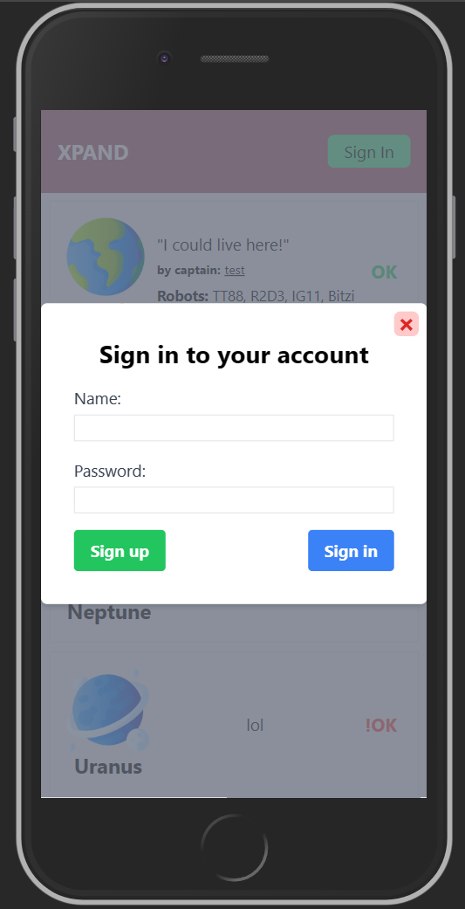

# Xpand

- Xpand.Api - the backend of the project
- Xpand.Web - the frontend of the project

## Data modeling

So on my first look, it looked like a really easy model to implement. But on closer inspection of the document, sceenshot and tasks, alot of modeleling idees came up, from which I choose the following:

I considered the following:

- each captain is leading ONE team
- each team has ONE shuttle
- each team has unique robots

The `Captain` model is the main user, such the other entities will depend on it. For fields, name and password are required, togheter with a `teamId` for realationships. A single 1-to-1 relationship with the captain's team would suffice.

The `Team` model is the team that the captain is leading. The fields for this model would be the team name. For relationships, as mentioned above, a single 1-to-1 relationship with the captain, a 1-to-1 relationship with the shuttle and a 1-to-many relationship with the robots. Each of this relationships would add a foreign key to the `Team` model.

The `Shuttle` model is the shuttle that the team is using. The fields for this model would be the shuttle name. For relationships, a single 1-to-1 relationship with the team is enough. In the curent model, this looks a bit useless? But considering potential future features, this could come in handy. For example, if we want to add restructions for the expeditions, like travel time, we could also add a `travelTime` field to the `Shuttle` model.

The `Robot` model is also quite a simple one, just a simple name. The relationships are a bit more complex. A single 1-to-many relationship to the robots team is enough. Also quite useless in the current model, but could be useful if let's say we implement an automatic planet exploration feature, where the robots would be sent to explore the planet and return with resources. Or in case of robot voting the planet status, we could add a method for robots to vote depending on various factors, like distance from the planet, resources, etc.

The `Planet` model is the most complex one. The fields are the planet name, the planet status (enumerated as described), image name, description and the planet's robot count. A single relationship back to the team is enough, as the team contains the captain reference and robots. The robot cound is just a field that can be modified by captains, but technically we could just count the robots in the team and automatically update the field. As for the staus of the planet, I considered the fact that if a planet status is TODO or En Route, the description and robot count would be empty. This is because the planet is not yet explored, so we don't know anything about it. The image name is just the name of the image file, which is saved locally in a defined directory. The image name is not a foreign key, as the image is not saved in the database, but on the server.

For the sake of simplicity, I also chose that on a captain creation, the team, shuttle and robots are also created. Normally, this would be done in a separate steps, where the captain would create the team, then the shuttle, then the robots. But here we can just initialize them accordingly with the captain's name.

## Implementation

For the backend I chose to use .Net 7, SQL Server and Entity Framework Core. For the frontend I chose to use Vue3 and Typescript. The authentication is done using JWT tokens. I didnt implement all the controllers, as I considered them to be quite simple and repetitive.

For creating the project I used the Vite to create a new Vue3 project, to which I added Tailwind CSS and Pina for state management.

## Running the project

### API

Dependencies:

- Microsoft.EntityFrameworkCore.SqlServer
- Microsoft.EntityFrameworkCore.Design
- Microsoft.AspNetCore.Authentication.JwtBearer

To run the API, you need to have SQL Server installed and running. The connection string is located in the `appsettings.json` file. The default is `Server=localhost;Database=Xpand;Trusted_Connection=True;`. You can change the connection string depending on your SQL Server configuration. You should create a new database, as Entity Framework will create the tables for you.

To run the API, you need to run the following commands in the `Xpand.Api` folder:

- `dotnet restore`
- `dotnet ef database update`
- `dotnet run`

### Client

Not going to list all the dependencies, as they are quite a lot. Check the `package.json` if you wish to explore them all.

To run the client, you need to run the following commands in the `Xpand.Web` folder:

- `npm install`
- `npm run dev`

## Screenshots

For testing the UI in a mobile enviroment, I use the brower's dev tools. Bellow are some screenshots of the UI in a mobile enviroment.

The main of the ui is a fixed Topbar with a sign-in/sing-out button. The main content is a list of planets, each of them can be clicked to open a modal with the planet editing form. Only authenticated users can edit the planets.

The sing-in button opens a modal with the login/signup form. The login/signup form is a simple form with name and password fields. Since both forms take the same parameters, I put both sign up/sign in forms in the same modal. Then depending on the pressed button, the form will either login or signup the user. After signing up, the user will need to login in order to access the planets editing.

The planet editing form takes the planet name, status, description and robot count. Optioanlly, the planet image can be changed, and a teamId can also be specified for the planet. This is just in case we would like to show the captain reference and robots list on the main page. In retrospect, this could have been a checkbox to include the current captain teamId.

## Conclusion

Bellow is the list of tasks that I completed:

UI:

- [x] Start an application from scratch in a chosen technology -> Vue3
- [x] Implement a way of retrieving the planet data from the API -> fetch requests
- [x] Implement the UI screen as shown in the mockup -> see above
- [x] Implement a way in which the user of the app can update the properties of the
      planet -> modal with form

Backend:

- [x] Start an application from scratch in the mentioned technology -> .Net 7, Vue3
- [x] Design de model for the mentioned problem -> see above
- [x] Choose a storage solution that can handle persistence of the model -> SQL Server
- [x] Implement a means to expose the model to the UI using a chosen protocol -> REST API

Technicaly speaking, all the tasks are completed. Are

Am I happy with the end result? Yeah, I think I tackled all the things I wanted in the time I had. Definetly code use some improvements, from models, to code structute (especially UI), but I think it's a good start.

I had a lot of fun working on this project, and I hope you will enjoy it as well. Looking forward to your feedback! :)
